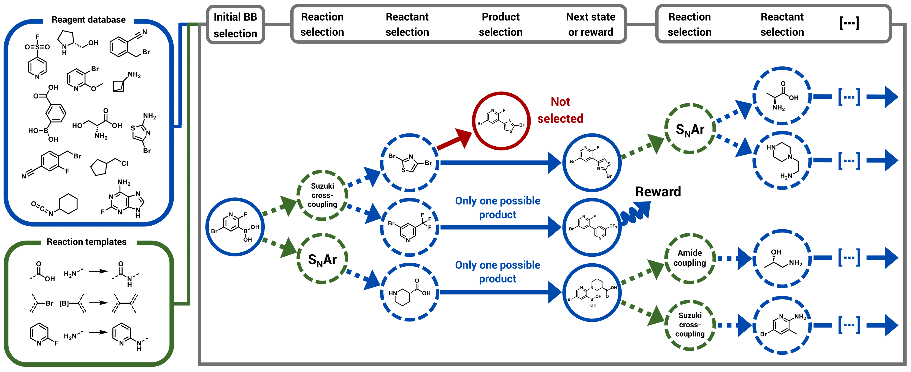

# RGFN: Reaction-GFlowNet

Code for "RGFN: Synthesizable Molecular Generation Using GFlowNets" [[arXiv]](https://arxiv.org/abs/2406.08506).
Repository based on [RetroGFN](https://github.com/gmum/RetroGFN).

RGFN is a generative model for designing diverse, high-reward small molecules. All produced molecules are highly likely to be synthesizable through the proposed synthesis pathways and cost ~100x less than those produced by competing methods. This is achieved by operating exclusively in the space of high-yield chemical reactions and low-cost reactants.



This repository allows users to reproduce experiments described in the associated paper and easily extend the framework to use custom oracles for optimization, e.g. by specifying a different protein target for the GPU-accelerated docking.

## Setup

To create the conda environment, run the following commands:

```bash
conda create --name rgfn python=3.11.8 -y
conda activate rgfn

# If using CUDA (NOTE: this assumes CUDA 11.8, replace with your CUDA version):
pip install torch==2.3.0 --index-url https://download.pytorch.org/whl/cu118
pip install dgl==2.2.1+cu118 -f https://data.dgl.ai/wheels/torch-2.3/cu118/repo.html

# If using CPU:
pip install torch==2.3.0 --index-url https://download.pytorch.org/whl/cpu
pip install dgl==1.1.2 -f https://data.dgl.ai/wheels/torch-2.3/cpu/repo.html

pip install -e .

# Optional development tools:
pip install pre-commit
pre-commit install
```

For convenience all experiments will be logged to `experiments` directory. If you want to store the experiments results
on other partition, you can create a symlink to the desired location:

```bash
ln -s <your_path> experiments
```

<details><summary><h3 style="display:inline-block">(Optional) Setup Vina-GPU-2.1</h3></summary>

Before following the instructions below, **please read these important notes**:
1. The user-specified workspace directory must be a full path.
2. The Vina-GPU-2.1 docking proxy requires a system-wide installation of CUDA to work on GPU (loaded by, e.g., `module load cuda/11.8`).
3. The setup.sh script installs Boost 1.83.0 to the workspace directory. If you would like to use a different version of boost, you will need to modify the setup.sh script.

To set up QV2GPU for use in the QV2GPU rescoring proxy, run the following command:

```bash
sh scripts/install_qv2gpu.sh <workspace_directory>
```

The default installation path points to `quickvina_dir`. To make this work with your Vina-GPU-2.1 installation path, you can create a symlink:

```bash
ln -s <your-Vina-GPU-2.1_installation_path> quickvina_dir
```

</details>

<details><summary><h3 style="display:inline-block">(Optional) Setup GNEprop proxies</h3></summary>

Note that GNEprop is part of a not-yet published project, and access to the code and the models is restricted. In particular, you will need an access to a private github repository for the instructions below to work.

To setup environment for GNEprop proxies, run the following commands:

```bash
pip install descriptastorus==2.6.1 "ray[tune]==2.31.0" ax-platform==0.4.0 matplotlib==3.9.0 seaborn==0.13.2 umap-learn==0.5.6 pytorch-lightning==1.9.5
pip install lightning-bolts==0.7.0 --no-deps
```

To download the code for GNEprop model, run the following command:

```bash
sh external/setup_gneprop.sh
```

You also need to download the models manually from [google drive](https://drive.google.com/drive/folders/1v1kmXnxDxrMc_UrlP3ug7f6Ekfs5Z8QC) and put them inside `external/gneprop/models`. The code will look for the checkpoints in that location.

Finally, note that GNEprop requires a system-wide installation of CUDA to work on GPU (loaded by, e.g., `module load cuda/11.8`).

</details>

## Train

To train the RGFN using sEH proxy, run:

```sh
python train.py --cfg configs/rgfn_seh_proxy.gin
```

The script will dump the results under `experiments/rgfn_seh_proxy/<timestamp>` directory. Our code uses gin-config
package that allows for lightweight models configuration along with dependency injection.

<details><summary><h3 style="display:inline-block">Project Structure</h3></summary>

### API

Under `rgfn.api`, the repository provides a flexible API that clearly separates the GFlowNet components. The states,
actions and action spaces can be represented as an arbitrary classes, which allows for easy implementation of GFlowNets
with non-static environments (e.g. with dynamic action spaces).

- `env_base.py` Base class for environments. It provides a minimal and flexible interface that can be used to implement
  environments with dynamic action spaces. An action space is a set of possible actions that can be taken from a state
  in forward (forward action space) and backward (backward action space) direction. The reward is decoupled from the
  environment, so that environment should only describe the possible transitions between states. The environment can be
  reversed to enable backward sampling of the trajectories.
- `policy_base.py` A base class for policies. Given the current batch of states, a policy samples corresponding actions.
  It also computes the log probabilities when chosen actions and following states are provided.
- `sampler_base.py` A base class for samplers. A sampler samples trajectories from the environment using a policy.
- `trajectories.py`. A trajectory is a sequence of states and actions sampled by a sampler using the environment and the
  policy. Every state has a corresponding forward and backward action space which describe the possible actions that can
  be taken from that state. Trajectories are stored in a batch manner. The terminal states in the trajectories are
  assigned with rewards.
- `reward_base.py`. A class representing the reward function. The reward function is a function of a proxy output that
  takes a batch of states and computes rewards that are used to train the policy.
- `proxy_base.py`. A base class for proxies. A proxy is a function that takes a batch of states and computes values that
  are then used to compute the reward.
- `objective_base.py`. A base class for GFN objectives. An objective is a function that takes a batch of trajectories
  and computes the loss (objective)
- `replay_buffer_base.py`. A base class for replay buffers. A replay buffer stores terminal states or trajectories and
  can sample them
  in backward direction using the provided sampler.

### Shared

Under `rgfn.shared`, the repository provides shared utilities that are used across the different GFlowNets
implementations, e.g. Trajectory Balance Objective, Conditioned Trajectory Balance Objective, uniform policy, cached
proxy base class, random samplers, reward_prioritized buffer, etc.

### GFNs

Under `rgfn.gfns`, the repository provides the implementation of the GFlowNets.

</details>

## Citation

```text
@article{koziarski2024rgfn,
  title={{RGFN}: Synthesizable molecular generation using {GFlowNets}},
  author={Koziarski, Micha{\l} and Rekesh, Andrei and Shevchuk, Dmytro and van der Sloot, Almer and Gai{\'n}ski, Piotr and Bengio, Yoshua and Liu, Chenghao and Tyers, Mike and Batey, Robert},
  journal={Advances in Neural Information Processing Systems},
  volume={37},
  pages={46908--46955},
  year={2024}
}
```
